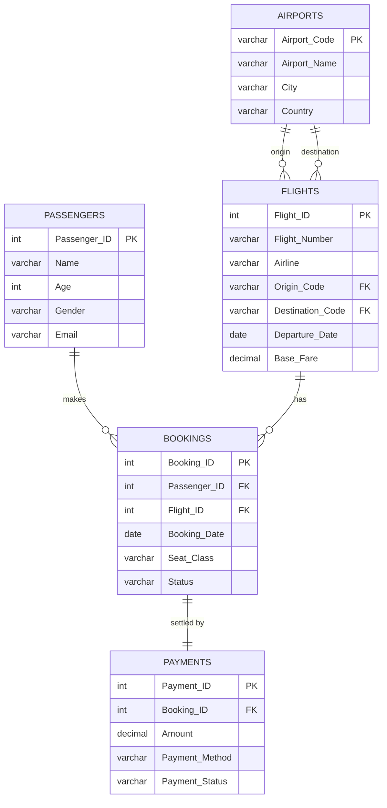
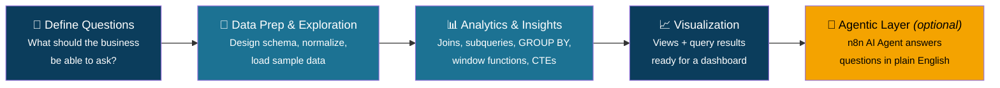

<div align="center">

# ✈️ SkyBook
### Airline Flight Booking & Revenue Management System

**A relational SQL project covering joins, subqueries, aggregation, window functions, CTEs, indexes, views — and an optional AI agent layer.**


</div>

---

## 📖 Table of Contents

- [Overview](#-overview)
- [Features](#-features)
- [Entity Relationship Diagram](#-entity-relationship-diagram)
- [Database Schema](#-database-schema)
- [Project Workflow](#-project-workflow)
- [Window Functions Showcase](#-window-functions-showcase)
- [File Structure](#-file-structure)
- [Getting Started](#-getting-started)
- [Sample Queries](#-sample-queries)
- [Roadmap](#-roadmap)
- [Author](#-author)

---

## 🧭 Overview

**SkyBook** models how an airline actually runs its booking desk: passengers reserve seats on flights, seats turn into bookings, and bookings turn into payments. The project builds that world as a normalized 5-table MySQL database, then answers **30 real business questions** against it — from simple filters to running revenue totals computed with SQL window functions.

It exists to demonstrate, in one project, everything a relational database is actually *for*: clean schema design, multi-table joins, aggregate reporting, and analytics that would normally need a spreadsheet or BI tool — done natively in SQL.

---

## ✨ Features

- 🗂️ **Normalized schema** — 5 linked tables, no redundant data
- 🔗 **Every relationship type** — 1:1, 1:M, and a resolved M:M
- 🔍 **30 solved queries** — filtering, joins, subqueries, `GROUP BY` / `HAVING`
- 🪟 **6 window-function patterns** — `RANK()`, `ROW_NUMBER()`, `LAG()`, `NTILE()`, running totals, moving averages
- 🧩 **CTEs** — multi-step logic written as readable `WITH` clauses
- ⚡ **Indexes** — single-column and unique indexes for faster lookups
- 👁️ **Views** — reusable virtual tables for revenue and high-value payments
- 🤖 **Optional agentic layer** — natural-language questions answered live via an n8n AI agent wired to the database

---

## 🗺️ Entity Relationship Diagram



---

## 🧱 Database Schema

| Table | Rows | Key Columns | Relationship |
|---|---|---|---|
| ✈️ **Airports** | 10 | `Airport_Code` (PK) | Origin & destination for Flights |
| 🛫 **Flights** | 15 | `Flight_ID` (PK), `Origin_Code`/`Destination_Code` (FK) | 1:M into Bookings |
| 🧑‍💼 **Passengers** | 20 | `Passenger_ID` (PK) | 1:M into Bookings |
| 🎫 **Bookings** | 25 | `Booking_ID` (PK), `Passenger_ID`/`Flight_ID` (FK) | Junction table; 1:1 into Payments |
| 💳 **Payments** | 25 | `Payment_ID` (PK), `Booking_ID` (FK) | Settles each Booking |

> 💡 `Flights` references `Airports` **twice** — once for origin, once for destination — a clean real-world example of two foreign keys pointing at the same parent table.

---

## 🔄 Project Workflow



**How a question travels through the system:**

```
 "Which airline earned the most revenue?"
            │
            ▼
   ┌─────────────────┐
   │   Flights table  │──┐
   └─────────────────┘  │
   ┌─────────────────┐  │      JOIN            ┌───────────────┐
   │  Bookings table  │──┼───────────────────▶ │  GROUP BY      │
   └─────────────────┘  │                       │  Airline       │──▶ 📊 Answer
   ┌─────────────────┐  │                       └───────────────┘
   │  Payments table  │──┘
   └─────────────────┘
```

---

## 🪟 Window Functions Showcase

| Function | What it does here | Query |
|---|---|---|
| `SUM() OVER` | Running cumulative revenue, day by day | Q12 |
| `RANK()` | Ranks passengers by total spend (ties share a rank) | Q21 |
| `ROW_NUMBER()` + `PARTITION BY` | Numbers each passenger's own bookings in order | Q22 |
| `LAG()` | Compares each flight's fare to the one before it | Q23 |
| `AVG() OVER (ROWS...)` | 3-day moving average of daily revenue | Q24 |
| `NTILE(4)` | Splits flights into fare quartiles | Q25 |

```sql
-- Q21 — Rank passengers by total spend
SELECT b.Passenger_ID, SUM(pay.Amount) AS Total_Spent,
       RANK() OVER (ORDER BY SUM(pay.Amount) DESC) AS Spend_Rank
FROM Bookings b JOIN Payments pay ON b.Booking_ID = pay.Booking_ID
GROUP BY b.Passenger_ID;
```

---

## 📁 File Structure

```
SkyBook/
├── 📄 skybook_schema.sql              # Table definitions + sample data
├── 📄 skybook_queries.sql             # All 30 queries (Q1–Q30) + indexes + views
├── 📘 SkyBook_Airline_SQL_Project.docx # Full report: concepts, ERD, code, Q&A
├── 📊 SkyBook_Presentation.pptx        # Slide deck for presenting the project
└── 📜 README.md                        # You are here
```

---

## 🚀 Getting Started

```bash
# 1. Create the database and load schema + sample data
mysql -u root -p < skybook_schema.sql

# 2. Run the full query set
mysql -u root -p SkyBookDB < skybook_queries.sql

# 3. Or explore interactively
mysql -u root -p SkyBookDB
mysql> SELECT * FROM Flights WHERE Origin_Code = 'DEL';
```

---

## 🔎 Sample Queries

<details>
<summary><b>Q17 — Which airline earned the most total revenue?</b></summary>

```sql
SELECT f.Airline, SUM(pay.Amount) AS Total_Revenue
FROM Flights f JOIN Bookings b ON f.Flight_ID = b.Flight_ID
JOIN Payments pay ON b.Booking_ID = pay.Booking_ID
GROUP BY f.Airline ORDER BY Total_Revenue DESC LIMIT 1;
```
**Result:** Vistara — ₹35,150
</details>

<details>
<summary><b>Q26 — Passengers whose total spend exceeds ₹9000 (CTE)</b></summary>

```sql
WITH PassengerSpend AS (
    SELECT b.Passenger_ID, SUM(pay.Amount) AS Total_Spent
    FROM Bookings b JOIN Payments pay ON b.Booking_ID = pay.Booking_ID
    GROUP BY b.Passenger_ID
)
SELECT p.Name, ps.Total_Spent
FROM PassengerSpend ps JOIN Passengers p ON ps.Passenger_ID = p.Passenger_ID
WHERE ps.Total_Spent > 9000
ORDER BY ps.Total_Spent DESC;
```
</details>

---

## 🛣️ Roadmap

- [x] Normalized schema with 5 tables
- [x] 30 solved SQL queries with verified output
- [x] Window functions, CTEs, indexes, views
- [x] Presentation deck
- [ ] Power BI dashboard on top of the views
- [ ] n8n AI agent for natural-language querying

---

## 👤 Author

**Sadia Uzma Ashrafi Srijita Das Gourab Mondal Tuhin Roy**
